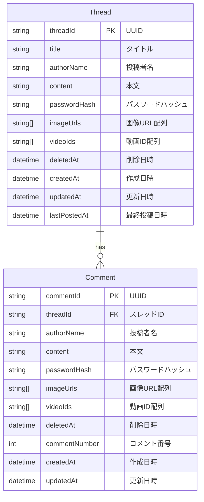

# データベース設計

## 1. ER図



## 2. Prismaスキーマ定義

```prisma
// Thread（スレッド）テーブル
model Thread {
  threadId     String    @id @map("thread_id")
  title        String    @db.VarChar(100)  // タイトル（最大100文字）
  authorName   String    @map("author_name") @db.VarChar(50)   // 投稿者名（最大50文字）
  content      String    @db.Text          // 本文（最大2000文字はアプリケーション側で制御）
  passwordHash String?   @map("password_hash") @db.VarChar(255)  // bcryptハッシュ（任意）
  imageUrls    String[]  @map("image_urls")     // Supabase Storage URL配列
  videoIds     String[]  @map("video_ids")      // Cloudflare Stream ID配列
  deletedAt    DateTime? @map("deleted_at")     // 削除日時（NULL = 未削除）
  createdAt    DateTime  @default(now()) @map("created_at")   // 作成日時
  updatedAt    DateTime  @updatedAt @map("updated_at")        // 更新日時
  lastPostedAt DateTime  @default(now()) @map("last_posted_at")   // 最終投稿日時（コメント投稿時に更新）
  
  // リレーション
  comments     Comment[]
  
  // インデックス
  @@index([deletedAt, lastPostedAt(sort: Desc)])  // 一覧表示用
  @@index([createdAt(sort: Desc)])                 // 作成日順表示用
  
  @@map("threads")
}

// Comment（コメント）テーブル
model Comment {
  commentId     String    @id @map("comment_id")
  threadId      String    @map("thread_id")     // 所属スレッドID
  authorName    String    @map("author_name") @db.VarChar(50)    // 投稿者名（最大50文字）
  content       String    @db.Text           // 本文（最大1000文字はアプリケーション側で制御）
  passwordHash  String?   @map("password_hash") @db.VarChar(255)   // bcryptハッシュ（任意）
  imageUrls     String[]  @map("image_urls")      // Supabase Storage URL配列
  videoIds      String[]  @map("video_ids")       // Cloudflare Stream ID配列
  deletedAt     DateTime? @map("deleted_at")      // 削除日時（NULL = 未削除）
  commentNumber Int       @map("comment_number")  // スレッド内でのコメント番号
  createdAt     DateTime  @default(now()) @map("created_at")    // 作成日時
  updatedAt     DateTime  @updatedAt @map("updated_at")         // 更新日時
  
  // リレーション
  thread        Thread    @relation(fields: [threadId], references: [threadId], onDelete: Cascade)
  
  // インデックス
  @@index([threadId, commentNumber])                    // コメント番号での検索用
  @@index([threadId, deletedAt, createdAt])            // スレッド内コメント表示用
  @@unique([threadId, commentNumber])                   // コメント番号の一意性保証
  
  @@map("comments")
}
```

## 3. テーブル詳細

### 3.1 Threadテーブル

| カラム名 | データ型 | NULL | デフォルト | 説明 |
|---------|---------|------|-----------|------|
| thread_id | UUID | NO | - | 主キー（アプリ側で生成） |
| title | VARCHAR(100) | NO | - | スレッドタイトル |
| author_name | VARCHAR(50) | NO | - | 投稿者名 |
| content | TEXT | NO | - | 本文 |
| password_hash | VARCHAR(255) | YES | NULL | パスワードのbcryptハッシュ |
| image_urls | TEXT[] | NO | [] | 画像URLの配列（JSON） |
| video_ids | TEXT[] | NO | [] | 動画IDの配列（JSON） |
| deleted_at | TIMESTAMP | YES | NULL | 削除日時（NULL = 未削除） |
| created_at | TIMESTAMP | NO | now() | 作成日時 |
| updated_at | TIMESTAMP | NO | now() | 更新日時 |
| last_posted_at | TIMESTAMP | NO | now() | 最終投稿日時 |

### 3.2 Commentテーブル

| カラム名 | データ型 | NULL | デフォルト | 説明 |
|---------|---------|------|-----------|------|
| comment_id | UUID | NO | - | 主キー（アプリ側で生成） |
| thread_id | UUID | NO | - | 所属スレッドID（外部キー） |
| author_name | VARCHAR(50) | NO | - | 投稿者名 |
| content | TEXT | NO | - | 本文 |
| password_hash | VARCHAR(255) | YES | NULL | パスワードのbcryptハッシュ |
| image_urls | TEXT[] | NO | [] | 画像URLの配列（JSON） |
| video_ids | TEXT[] | NO | [] | 動画IDの配列（JSON） |
| deleted_at | TIMESTAMP | YES | NULL | 削除日時（NULL = 未削除） |
| comment_number | INTEGER | NO | - | スレッド内コメント番号 |
| created_at | TIMESTAMP | NO | now() | 作成日時 |
| updated_at | TIMESTAMP | NO | now() | 更新日時 |

## 4. インデックス設計

### 4.1 Threadテーブルのインデックス

1. **複合インデックス: (deleted_at, last_posted_at DESC)**
   - 用途：スレッド一覧表示（削除されていないスレッドを最終投稿日時順に取得）
   - クエリ例：`WHERE deleted_at IS NULL ORDER BY last_posted_at DESC`

2. **単一インデックス: created_at DESC**
   - 用途：作成日順でのスレッド表示
   - クエリ例：`ORDER BY created_at DESC`

### 4.2 Commentテーブルのインデックス

1. **複合インデックス: (thread_id, comment_number)**
   - 用途：特定スレッドのコメントを番号順に取得
   - クエリ例：`WHERE thread_id = ? ORDER BY comment_number`

2. **複合インデックス: (thread_id, deleted_at, created_at)**
   - 用途：特定スレッドの表示可能なコメントを時系列で取得
   - クエリ例：`WHERE thread_id = ? AND deleted_at IS NULL ORDER BY created_at`

3. **ユニーク制約: (thread_id, comment_number)**
   - 用途：同一スレッド内でコメント番号の重複を防ぐ

## 5. データ型の選定理由

### 5.1 ID（UUID）
- グローバルに一意
- 衝突の可能性が極めて低い
- アプリケーション側で生成可能
- 推測困難
- プレフィックスによるエンティティ識別が容易

### 5.2 配列型（image_urls, video_ids）
- PostgreSQLのネイティブ配列型を活用
- JSONよりも高速なクエリ
- Prismaでの扱いが簡単

### 5.3 論理削除（deleted_at）
- データの完全削除を避ける
- 削除日時の記録が可能
- 復元可能性を残す
- NULL判定で未削除の判別が簡単

## 6. トランザクション処理

### 6.1 コメント投稿時
```typescript
// トランザクション内で実行
1. コメント番号の最大値を取得
2. 新しいコメントを挿入（番号は最大値+1）
3. スレッドのlastPostedAtを更新
```

### 6.2 スレッド削除時
```typescript
// カスケード削除は使用しない（論理削除のため）
1. スレッドのdeletedAtに現在日時を設定
2. 関連するコメントは削除しない（表示は継続）
```

## 7. マイグレーション戦略

### 7.1 初期マイグレーション
```bash
# Prismaマイグレーションファイル生成
pnpm prisma migrate dev --name init_board_tables

# 本番環境への適用
pnpm prisma migrate deploy
```

### 7.2 将来の拡張性
- テーブル分割の可能性（メディア情報を別テーブル化）
- パーティショニング（日付でのテーブル分割）
- 読み取り専用レプリカの追加