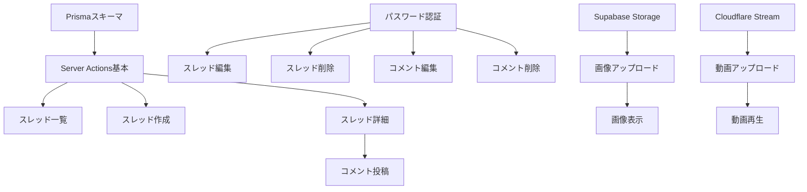

# 実装計画

## 1. 全体スケジュール

総工数：約2.5週間（13営業日）

| フェーズ | 期間 | 主な成果物 |
|---------|------|-----------|
| Phase 1: 基本機能 | 5日 | DB構築、CRUD実装、基本画面 |
| Phase 2: 編集・削除機能 | 3日 | パスワード認証、編集・削除機能 |
| Phase 3: メディア対応 | 3日 | 画像・動画アップロード機能 |
| Phase 4: 仕上げ | 2日 | UI改善、テスト、最適化 |

## 2. Phase 1: 基本機能（5日）

### Day 1: データベース構築とセットアップ
- [ ] Prismaスキーマ定義（Thread, Comment）
- [ ] マイグレーション実行
- [ ] シードデータ作成
- [ ] 基本的な型定義

### Day 2: Server Actions実装
- [ ] createThreadAction実装
- [ ] getThreadList実装
- [ ] getThreadDetail実装
- [ ] エラーハンドリング実装

### Day 3: スレッド一覧画面
- [ ] /member/board/page.tsx作成
- [ ] ThreadListContainer実装（RSC）
- [ ] ThreadListPresenter実装
- [ ] ThreadCard コンポーネント実装
- [ ] ページネーション実装

### Day 4: スレッド作成画面
- [ ] /member/board/new/page.tsx作成
- [ ] CreateThreadForm実装
- [ ] バリデーション実装（Valibot）
- [ ] 成功/エラー処理

### Day 5: スレッド詳細・コメント投稿
- [ ] /member/board/[threadId]/page.tsx作成
- [ ] ThreadDetailContainer実装
- [ ] createCommentAction実装
- [ ] CreateCommentForm実装
- [ ] CommentList表示

## 3. Phase 2: 編集・削除機能（3日）

### Day 6: パスワード認証基盤
- [ ] bcryptセットアップ
- [ ] verifyPasswordAction実装
- [ ] PasswordModal コンポーネント作成
- [ ] パスワード検証フロー実装

### Day 7: スレッド編集・削除
- [ ] updateThreadAction実装
- [ ] deleteThreadAction実装（論理削除）
- [ ] /member/board/[threadId]/edit/page.tsx作成
- [ ] EditThreadForm実装
- [ ] 削除確認ダイアログ実装

### Day 8: コメント編集・削除
- [ ] updateCommentAction実装
- [ ] deleteCommentAction実装（論理削除）
- [ ] EditCommentModal実装
- [ ] 削除済み表示処理
- [ ] コメント番号管理

## 4. Phase 3: メディア対応（3日）

### Day 9: Supabase Storage設定
- [ ] Storage バケット作成
- [ ] アップロードポリシー設定
- [ ] uploadImageAction実装
- [ ] 画像プレビュー機能
- [ ] 画像削除機能

### Day 10: 画像表示機能
- [ ] MediaViewer コンポーネント作成
- [ ] サムネイル生成
- [ ] Lightbox実装
- [ ] レスポンシブ対応

### Day 11: Cloudflare Stream対応
- [ ] Cloudflare Stream設定
- [ ] uploadVideoAction実装
- [ ] VideoPlayer コンポーネント作成
- [ ] 動画削除機能

## 5. Phase 4: 仕上げ（2日）

### Day 12: UI/UXブラッシュアップ
- [ ] ローディング状態の改善
- [ ] エラー表示の改善
- [ ] モバイル対応の確認
- [ ] アクセシビリティ改善
- [ ] アニメーション追加

### Day 13: テストと最適化
- [ ] ユニットテスト作成（Vitest）
- [ ] E2Eテスト作成（Playwright）
- [ ] パフォーマンス最適化
- [ ] セキュリティ確認
- [ ] ドキュメント更新

## 6. 実装順序の依存関係



## 7. 各フェーズのチェックポイント

### Phase 1 完了条件
- スレッドの作成・一覧表示・詳細表示が動作
- コメント投稿が動作
- 基本的なエラーハンドリング完了

### Phase 2 完了条件
- パスワード認証が動作
- スレッド・コメントの編集が動作
- 論理削除と表示制御が動作

### Phase 3 完了条件
- 画像のアップロード・表示が動作
- 動画のアップロード・再生が動作
- メディア削除が動作

### Phase 4 完了条件
- 全機能の結合テスト完了
- パフォーマンス目標達成
- ドキュメント完成

## 8. リスクと対策

### 技術的リスク
| リスク | 影響度 | 対策 |
|--------|--------|------|
| Cloudflare Stream API連携 | 高 | 事前に技術検証を実施 |
| ファイルアップロードのサイズ制限 | 中 | クライアント側で事前チェック |
| 同時投稿によるコメント番号重複 | 中 | トランザクション処理で制御 |

### スケジュールリスク
| リスク | 影響度 | 対策 |
|--------|--------|------|
| メディア機能の実装遅延 | 高 | 最悪メディア機能は後回し |
| テスト不足 | 中 | 各フェーズで段階的にテスト |

## 9. 成果物一覧

### ソースコード
```
apps/web/src/
├── features/board/      # 掲示板機能
├── app/member/board/    # ページコンポーネント
└── lib/                 # ユーティリティ

packages/database/
└── schema.prisma        # データベーススキーマ
```

### テストコード
```
apps/web/src/features/board/
├── **/*.test.ts         # ユニットテスト
└── **/*.e2e.test.ts     # E2Eテスト
```

### ドキュメント
```
docs/掲示板/
├── 要件定義.md
├── データベース設計.md
├── API設計.md
├── 画面設計.md
├── 実装計画.md
├── 技術仕様.md
└── セキュリティ仕様.md
```

## 10. 完了後の次ステップ

### 機能拡張案
1. リアルタイム更新（WebSocket）
2. ユーザー認証との連携
3. いいね機能
4. 通報機能
5. 検索機能
6. タグ機能

### 運用改善案
1. 管理画面の作成
2. モデレーション機能
3. アクセス解析
4. バックアップ自動化