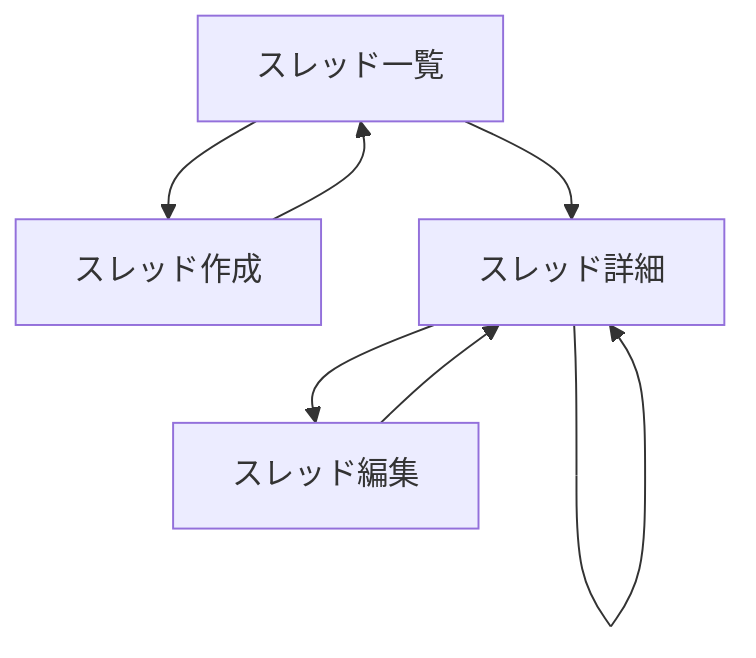

# 画面設計

## 1. 画面一覧

| 画面名 | パス | 説明 |
|--------|------|------|
| スレッド一覧 | /member/board | スレッド一覧表示画面 |
| スレッド作成 | /member/board/new | 新規スレッド作成画面 |
| スレッド詳細 | /member/board/[threadId] | スレッド詳細・コメント表示画面 |
| スレッド編集 | /member/board/[threadId]/edit | スレッド編集画面 |

## 2. 画面遷移図



## 3. 各画面の詳細設計

### 3.1 スレッド一覧画面（/member/board）

#### レイアウト構成
```
┌─────────────────────────────────────────┐
│ ヘッダー                                 │
├─────────────────────────────────────────┤
│ [新規スレッド作成ボタン]                 │
├─────────────────────────────────────────┤
│ スレッドカード                           │
│ ├─ タイトル                             │
│ ├─ 投稿者名                             │
│ ├─ 作成日時 | 最終投稿日時              │
│ └─ コメント数                           │
├─────────────────────────────────────────┤
│ スレッドカード                           │
├─────────────────────────────────────────┤
│ ...                                     │
├─────────────────────────────────────────┤
│ ページネーション                         │
└─────────────────────────────────────────┘
```

#### コンポーネント構成
- **ThreadListContainer** (RSC)
  - データ取得
  - ページネーション処理
- **ThreadListPresenter** (Client Component)
  - スレッドカード一覧表示
  - ページネーション UI
- **ThreadCard** (Client Component)
  - 個別スレッド情報表示
  - クリックで詳細画面へ遷移

### 3.2 スレッド作成画面（/member/board/new）

#### レイアウト構成
```
┌─────────────────────────────────────────┐
│ ヘッダー                                 │
├─────────────────────────────────────────┤
│ 新規スレッド作成                         │
├─────────────────────────────────────────┤
│ タイトル [_______________] *必須         │
├─────────────────────────────────────────┤
│ 名前 [_______________] *必須             │
├─────────────────────────────────────────┤
│ 本文                                    │
│ [_____________________________________] │
│ [_____________________________________] │
│ [_____________________________________] │
│ *必須                                   │
├─────────────────────────────────────────┤
│ パスワード [_______________]             │
│ ※編集・削除時に必要（任意）             │
├─────────────────────────────────────────┤
│ 画像添付 [ファイル選択] 最大4枚          │
│ プレビュー: [画像][画像][画像][画像]     │
├─────────────────────────────────────────┤
│ 動画添付 [ファイル選択] 最大1本          │
│ プレビュー: [動画プレイヤー]             │
├─────────────────────────────────────────┤
│ [キャンセル] [投稿]                      │
└─────────────────────────────────────────┘
```

#### コンポーネント構成
- **CreateThreadForm** (Client Component)
  - React Hook Form使用
  - Valibot バリデーション
  - メディアアップロード処理
  - Server Action呼び出し

### 3.3 スレッド詳細画面（/member/board/[threadId]）

#### レイアウト構成
```
┌─────────────────────────────────────────┐
│ ヘッダー                                 │
├─────────────────────────────────────────┤
│ スレッドタイトル                         │
│ 投稿者: [名前] | 投稿日時: [日時]        │
│ [編集] [削除]                           │
├─────────────────────────────────────────┤
│ 本文                                    │
│ ...                                     │
│ [画像表示エリア]                         │
│ [動画プレイヤー]                         │
├─────────────────────────────────────────┤
│ コメント一覧                             │
├─────────────────────────────────────────┤
│ 1. 名前 | 投稿日時 [編集][削除]          │
│    コメント本文...                       │
│    [画像][画像]                         │
├─────────────────────────────────────────┤
│ 2. 名前 | 投稿日時 [編集][削除]          │
│    （削除されました）                    │
├─────────────────────────────────────────┤
│ ...                                     │
├─────────────────────────────────────────┤
│ コメント投稿フォーム                     │
│ 名前 [_______________] *必須             │
│ 本文 [_____________________________]    │
│      [_____________________________]    │
│ パスワード [_______________]             │
│ 画像 [選択] 動画 [選択]                  │
│ [投稿]                                  │
└─────────────────────────────────────────┘
```

#### コンポーネント構成
- **ThreadDetailContainer** (RSC)
  - スレッド・コメントデータ取得
- **ThreadDetailPresenter** (Client Component)
  - スレッド情報表示
  - コメント一覧表示
- **CommentItem** (Client Component)
  - 個別コメント表示
  - 編集・削除ボタン
- **CreateCommentForm** (Client Component)
  - コメント投稿フォーム
  - Server Action呼び出し
- **PasswordModal** (Client Component)
  - パスワード入力モーダル
  - 編集・削除時に表示

### 3.4 スレッド編集画面（/member/board/[threadId]/edit）

#### レイアウト構成
```
┌─────────────────────────────────────────┐
│ ヘッダー                                 │
├─────────────────────────────────────────┤
│ スレッド編集                             │
├─────────────────────────────────────────┤
│ タイトル [現在のタイトル_____] *必須     │
├─────────────────────────────────────────┤
│ 本文                                    │
│ [現在の本文___________________________] │
│ [_____________________________________] │
│ [_____________________________________] │
│ *必須                                   │
├─────────────────────────────────────────┤
│ 現在の画像                               │
│ [画像][画像] [×削除][×削除]              │
├─────────────────────────────────────────┤
│ 画像追加 [ファイル選択]                  │
├─────────────────────────────────────────┤
│ 現在の動画                               │
│ [動画プレイヤー] [×削除]                 │
├─────────────────────────────────────────┤
│ 動画追加 [ファイル選択]                  │
├─────────────────────────────────────────┤
│ [キャンセル] [更新]                      │
└─────────────────────────────────────────┘
```

## 4. レスポンシブデザイン

### 4.1 ブレークポイント
- Mobile: 0-639px
- Tablet: 640-1023px
- Desktop: 1024px以上

### 4.2 モバイル対応
- スレッドカード：縦積み表示
- フォーム：全幅表示
- 画像：グリッド→縦並び
- テキスト：フォントサイズ調整

## 5. UI コンポーネント（shadcn/ui）

| コンポーネント | 使用箇所 |
|---------------|----------|
| Card | スレッドカード、コメント表示 |
| Button | 各種アクションボタン |
| Form | 投稿・編集フォーム |
| Input | テキスト入力 |
| Textarea | 本文入力 |
| Dialog | パスワード入力モーダル |
| Alert | エラー・成功メッセージ |
| Pagination | ページネーション |
| Skeleton | ローディング表示 |
| Toast | 通知メッセージ |

## 6. 状態管理

### 6.1 Server State
- スレッド一覧：RSCでサーバー側取得
- スレッド詳細：RSCでサーバー側取得

### 6.2 Client State
- フォーム状態：React Hook Form
- モーダル状態：useState
- アップロードプログレス：useState
- エラー状態：useState

## 7. アクセシビリティ

### 7.1 キーボード操作
- Tab キーでフォーカス移動
- Enter キーでボタン実行
- Escape キーでモーダル閉じる

### 7.2 ARIA属性
- role属性の適切な設定
- aria-label でボタン説明
- aria-describedby でエラー説明

### 7.3 セマンティックHTML
- 適切な見出しレベル（h1, h2, h3）
- nav要素でナビゲーション
- main要素でメインコンテンツ
- article要素でスレッド・コメント

## 8. パフォーマンス最適化

### 8.1 画像最適化
- Next.js Image コンポーネント使用
- lazy loading
- 適切なサイズでの配信
- WebP形式への自動変換

### 8.2 コード分割
- dynamic import でモーダル遅延読み込み
- Suspense でローディング表示

### 8.3 キャッシュ戦略
- スレッド一覧：ISR（60秒）
- 静的アセット：ブラウザキャッシュ

## 9. エラー処理

### 9.1 バリデーションエラー
- フィールド下にエラーメッセージ表示
- フォーカスを最初のエラーフィールドへ

### 9.2 サーバーエラー
- Toast通知で表示
- リトライボタン提供

### 9.3 404エラー
- カスタム404ページ
- トップページへのリンク提供